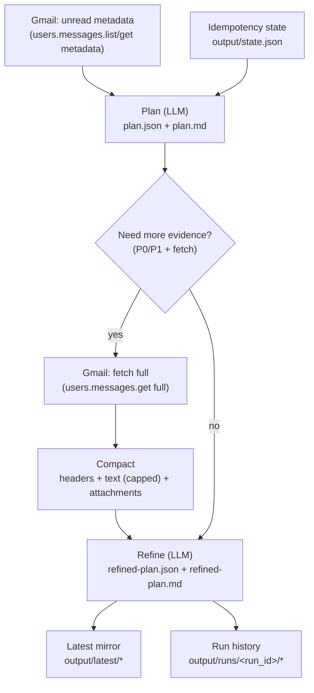
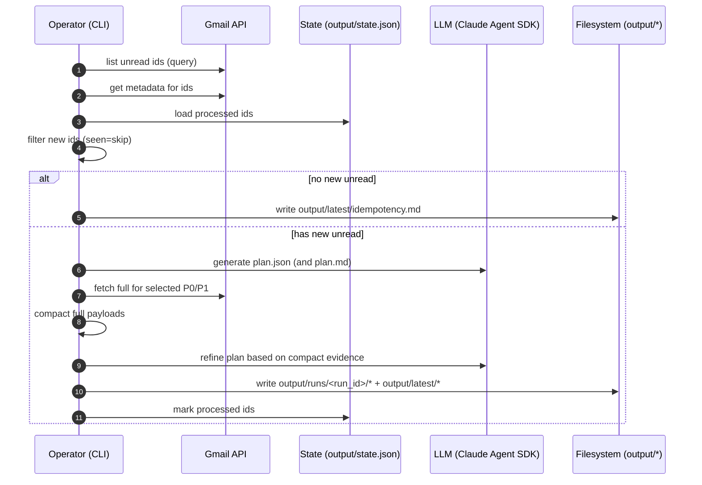

# huluwa-agent — Gmail Unread Triage Agent (TS)

A local-first demo agent that:

1) **Observes**: reads Gmail **unread** messages (metadata)
2) **Plans**: generates a **machine-readable plan (JSON)** + **human-readable plan (Markdown)**
3) **Enriches (read-only)**: fetches more evidence for P0/P1 (full message → compacted)
4) **Refines**: produces a **second-stage refined plan** based on the full evidence

> Current LLM backend: **Claude Agent SDK** (Claude Code runtime via `@anthropic-ai/claude-agent-sdk`).
> Security TODO: switch planning/refine to **local Ollama** to avoid off-device leakage.

---

## What it can do (capabilities)

- Gmail OAuth (local) + unread query
- Triage into P0/P1/P2 with explicit next steps
- Plan output in **two formats**:
  - `plan.json` (machine)
  - `plan.md` (human)
- Read-only evidence gathering for high-priority items (P0/P1)
- Refined plan based on fuller evidence:
  - `refined-plan.json`
  - `refined-plan.md`
- **Idempotency (seen=skip)** to avoid repeating work across runs

---

## Output layout

- Latest view:
  - `output/latest/unread.json`
  - `output/latest/plan.json`, `output/latest/plan.md`
  - `output/latest/refined-plan.json`, `output/latest/refined-plan.md`
  - `output/latest/idempotency.md` (explains why a run did nothing)

- Run history:
  - `output/runs/<run_id>/unread.json`
  - `output/runs/<run_id>/plan.json`, `plan.md`
  - `output/runs/<run_id>/full-compact/*.compact.json`
  - `output/runs/<run_id>/fetched.json`
  - `output/runs/<run_id>/refined-plan.json`, `refined-plan.md`

- State:
  - `output/state.json` (message-id idempotency)

- Archives (manual cleanups):
  - `output/archive/<timestamp>/...`

---

## Quickstart

### 0) Requirements

- Node.js >= 22
- Claude Code installed + authenticated (because we currently use `@anthropic-ai/claude-agent-sdk`)
- A Google Cloud project with Gmail API enabled (for OAuth)

### 1) Install dependencies

```bash
cd ~/.repo/huluwa-agent
npm install
```

### 2) Gmail OAuth setup (local)

1. Create OAuth Client (Desktop app) in Google Cloud Console
2. Download the client JSON and place it here:

```bash
mkdir -p ~/.repo/huluwa-agent/.secrets
cp ~/Downloads/client_secret_*.json ~/.repo/huluwa-agent/.secrets/credentials.json
```

### 3) Run

```bash
cd ~/.repo/huluwa-agent
npm run demo:gmail
```

First run will print an auth URL. Open it, authorize, paste the code back. A token will be stored at:

- `.secrets/token.json`

### 4) View results

- `output/latest/plan.md`
- `output/latest/refined-plan.md`

---

## Idempotency (seen=skip)

By default the agent **skips message IDs it has already processed**.

- Disable idempotency to re-process all unread anyway:

```bash
IDEMPOTENCY=false npm run demo:gmail
```

State utilities:

```bash
npm run state:show
npm run state:reset
```

---

## Privacy / security notes

- **Full message storage**: by default we do **not** store raw Gmail full-message JSON.
  - We store **compacted** artifacts under `full-compact/`.
  - For debugging only, you can opt into raw storage:

```bash
STORE_RAW_FULL=true npm run demo:gmail
```

- **LLM leakage risk**: planning/refine currently uses Claude runtime; email metadata/content is sent to the model.
  - Planned improvement: switch to local Ollama + local redaction.

---

## Configuration

See `.env.example`.

Common knobs:
- `GMAIL_QUERY`
- `GMAIL_MAX_RESULTS`
- `IDEMPOTENCY` (default true)
- `STORE_RAW_FULL` (default false)
- `CLAUDE_MODEL` (optional)

---

## Architecture (runtime)

### High-level flow



### Sequence (single run)



More detail: see `RUNTIME.md`.

---

## What’s missing / next steps

- Local Ollama backend (primary) + Claude optional fallback
- Better idempotency semantics: separate **seen** vs **handled**
- Cron scheduling (L2) for automatic runs
- Optional controlled execution (L3): labels/archive/drafts behind confirmation

Progress log: `PROGRESS.md`
