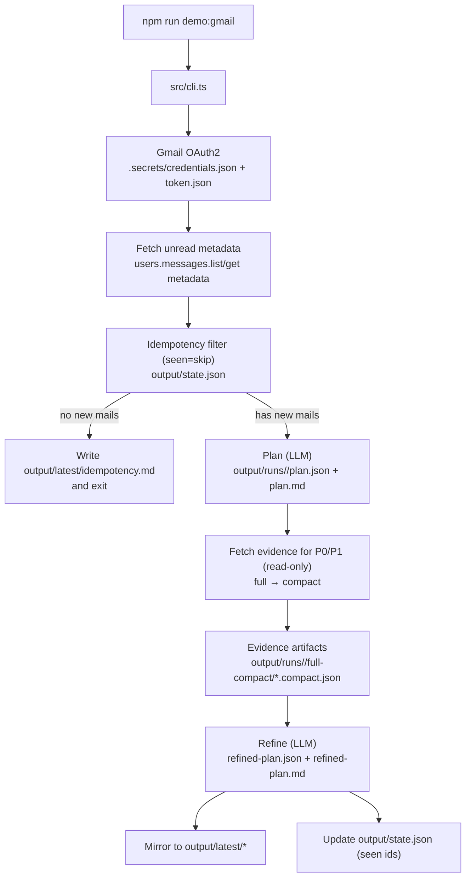
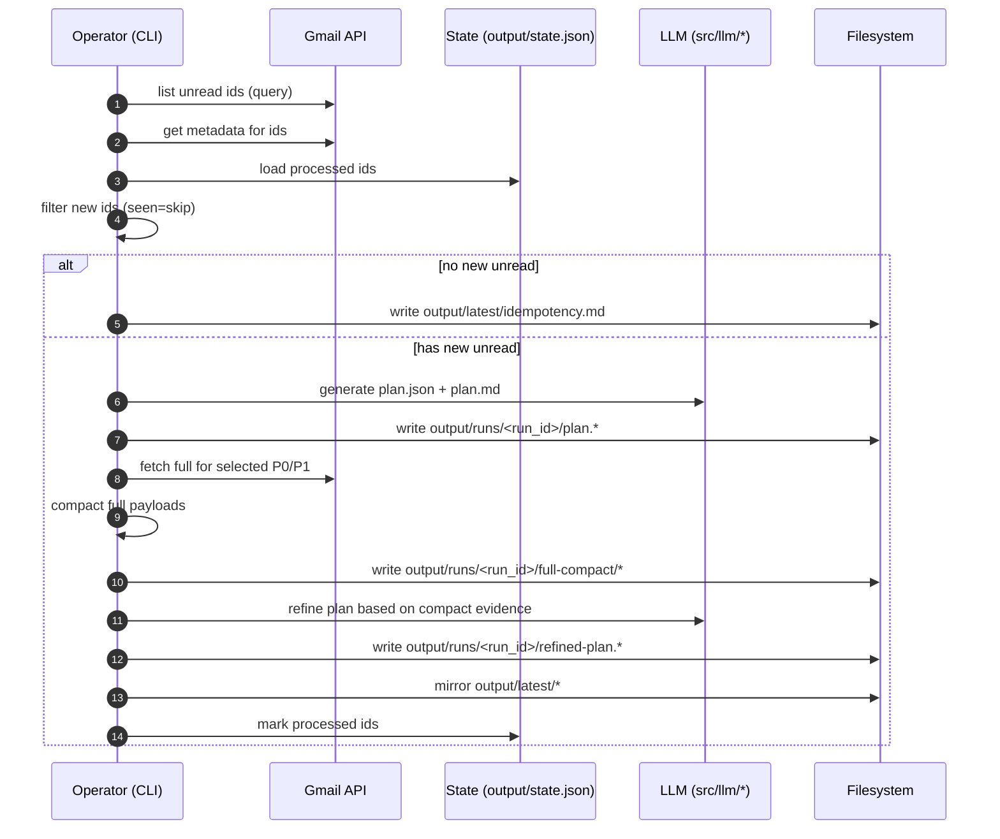

# huluwa-agent — Runtime / 执行流程说明

> 这是基于 **当前代码结构**（plan → fetch(full→compact) → refine + idempotency + latest 镜像）整理的运行时文档。
> 目的：让你快速理解“它跑起来到底做了什么、产物在哪里、哪些开关会影响行为”。

## 0) 一句话概览

`npm run demo:gmail` 会：

1. 拉取 Gmail 未读（metadata）
2. 做幂等过滤（seen=skip）
3. 生成处理计划（plan.json + plan.md）
4. 对计划里 P0/P1 需要补证据的邮件抓取 full，并落盘 **compact**
5. 基于 compact 证据生成二阶段计划（refined-plan.json + refined-plan.md）
6. 更新 `output/latest/*`（方便随时查看）
7. 写入 `output/state.json`（下次用于幂等）

---

## 1) 启动方式

```bash
cd ~/.repo/huluwa-agent
npm run demo:gmail
```

脚本：`demo:gmail = tsx src/cli.ts`。

---

## 2) 关键目录与产物

### 2.1 运行产物（run history）

每次真正执行（有新邮件要处理）会写入：

- `output/runs/<run_id>/unread.json` — 本次处理的“新未读”邮件（metadata）
- `output/runs/<run_id>/plan.json` / `plan.md` — 一阶段计划（机器/人类）
- `output/runs/<run_id>/fetched.json` — 本次抓取到的证据索引（指向 compact 文件）
- `output/runs/<run_id>/full-compact/*.compact.json` — P0/P1 邮件的 compact 证据（默认）
- `output/runs/<run_id>/refined-plan.json` / `refined-plan.md` — 二阶段计划（基于证据）

`run_id` 形如：`YYYYMMDD-HHMMSS-<uuid>`（例如：`20260131-134034-...`）

### 2.2 最新视图（latest mirror）

每次运行都会同步更新：

- `output/latest/unread.json`
- `output/latest/plan.json` / `plan.md`
- `output/latest/refined-plan.json` / `refined-plan.md`
- `output/latest/idempotency.md`（当本次没有新邮件时，用于解释为什么没做事）

### 2.3 幂等状态（state）

- `output/state.json` — 记录已处理过的 Gmail messageId（seen=skip）

辅助命令：

```bash
npm run state:show
npm run state:reset
```

### 2.4 归档（archive）

- `output/archive/<timestamp>/...` — 手动/清理时归档的历史输出

---

## 3) 代码执行顺序（按模块）

入口：`src/cli.ts`

1. **读取配置**
   - 读取 `GMAIL_QUERY` / `GMAIL_MAX_RESULTS` 等
2. **Gmail OAuth2**：`src/gmail/client.ts`
   - 读取 `.secrets/credentials.json`
   - 读取/生成 `.secrets/token.json`
3. **拉取未读 metadata**：`src/gmail/unread.ts`
4. **幂等过滤（seen=skip）**：`src/state/idempotency.ts`
   - 读取 `output/state.json`
   - 过滤出“没处理过的 messageId”
   - 如果过滤后为 0：写 `output/latest/idempotency.md` 并退出
5. **生成 plan**：`src/agent/plan.ts`
   - run_id 在这里生成（时间串-uuid）
   - LLM 调用通过 `src/llm/*` 适配层
6. **抓取证据（只读）**：`src/agent/execute-fetch.ts`
   - 对 P0/P1 且 `fetch != none` 的项抓取 Gmail full
   - 默认只落盘 compact 到 `full-compact/`
7. **二阶段 refine**：`src/agent/refine.ts`
   - 读取 `fetched.json` 指向的 compact 文件
   - 产出 refined-plan
8. **写 latest 镜像 + 写 state**：`src/cli.ts`
   - 写入 `output/latest/*`
   - 更新 `output/state.json`（seen=skip）

---

## 4) Mermaid 运行时图（流程图）



---

## 5) Mermaid 运行时图（时序图）



---

## 6) 配置开关（重要）

见 `.env.example`。常用：

- `GMAIL_QUERY`
- `GMAIL_MAX_RESULTS`
- `IDEMPOTENCY`（默认 true；false 时会重复处理所有未读）
- `STORE_RAW_FULL`（默认 false；true 时会额外落盘 `full/*.json`，仅用于 debug）
- `CLAUDE_MODEL`（可选）

---

## 7) 已知限制 / TODO

- **隐私**：当前 plan/refine 仍使用 Claude（会把邮件元信息/compact 证据送到模型）；计划切换到本地 Ollama。
- **幂等语义**：当前是 seen=skip（省 token 但可能跳过“仍未处理但未读”的邮件）。
- **执行动作**：目前不做任何写操作（不标记已读、不归档、不打标签、不发信），只产出计划。
